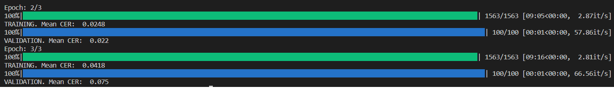

### Пример OCR с использованием CRNN & CTC Loss
Хватает всего 3 эпох для обучения модели. Пример обучения представлен ниже.

</a>

Запуск проекта:
1. Установить зависимости
```
pip install -r requirements.txt
```
2. Запустить обучение
```
python train.py
```
3. В папке `output` проверить примеры распознаваний после обучения модели.

### Исходный проект:
* https://github.com/dredwardhyde/crnn-ctc-loss-pytorch